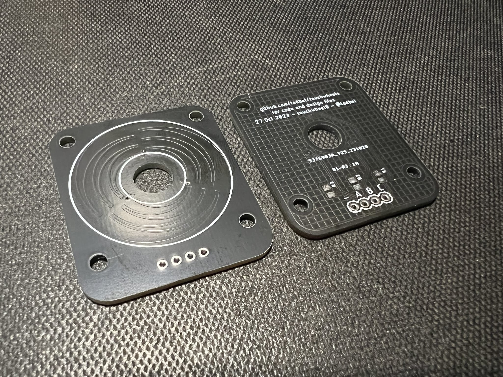

# Touchwheels

Some capacitive sense rotary touchwheels.  

These work by using only three capactive touch pads in a specific interleaved 
geometry and measuring the relative ratio of analog capacitive touch values 
between the pads to compute a distance along the slider. 

### Touchwheels made so far: 

* touchwheel0 - [available on Tindie as a kit!](https://www.tindie.com/products/todbot/touchwheel0-capacitive-touch-wheel/)

  
  
  Similar to an iPod's wheel, `touchwheel0` is a 30 mm (0.6") diameter 
  [rotary capacitive touch slider](https://onlinedocs.microchip.com/pr/GUID-A8A0085D-58D1-4E41-A07D-B93BFDE11AFE-en-US-4/index.html?GUID-FB5E9311-C731-4326-82D2-CD5F0ED8E378) that can be used with most any microcontroller. It uses three digital GPIO pins and requires no extra components. The included examples in CircuitPython and Arduino show how to turn the raw capacitive touch readings of the three pins into a linear 0-360º angle measurement.

* picoslidertoy - Available at the [picoslidertoy repo](https://github.com/todbot/picoslidertoy)
  
  

### Demos:

There are several examples on how to use the touchwheel:

- [demo0](./circuitpython/demo0/code.py) -
    CircuitPython example showing basic concept on touchwheel0
  
- [touchwheel_badgedemo](./circuitpython/touchwheel_badgedemo/code.py) - 
    CircuitPython example for the Hackaday SuperCon 2023 badge (where touchwheel0 PCBs were given away)
    
- [demo_dual](./circuitpython/demo_dual/code.py) - 
    CircuitPython example show two touchwheel0s in use

- more demos coming!

### What's in Tindie touchwheel0 kit: 

The [touchwheel0 kit](https://www.tindie.com/products/todbot/touchwheel0-capacitive-touch-wheel/)
on Tindie comes with:

- touchwheel0 black PCB
- 4 x 1M 0805 SMD resistors (only three needed, one is a spare)
- 1 x 4-pin pin header 

It makes a pretty good "first SMD soldering" exercise as the 0805 resistors 
are relatively big and not very heat sensitive. 

### Demo videos:

- demo dual:
  [(click to view on youtube)](https://www.youtube.com/watch?v=Db7S75eE-G8)

  

- demo0: 

  https://github.com/todbot/touchwheels/assets/274093/fc2b794f-5dff-42b4-8942-f141de19e4ab

### Useful links:

- [AN2934 - Capacitive Touch Sensor Design Guide (pdf)](https://ww1.microchip.com/downloads/en/Appnotes/Capacitive-Touch-Sensor-Design-Guide-DS00002934-B.pdf)
- [QTAN007 - Buttons, Sliders and Wheels - Sensor Design Guide (pdf)](https://www.mouser.com/pdfDocs/QTouch_QTAN0079.pdf)
- [AT02259: QTouch Schematic and Layout Checklist (pdf)](http://ww1.microchip.com/downloads/en/appnotes/atmel-42094-qtouch-schematic-and-layout-checklist_applicationnote_at02259.pdf)
